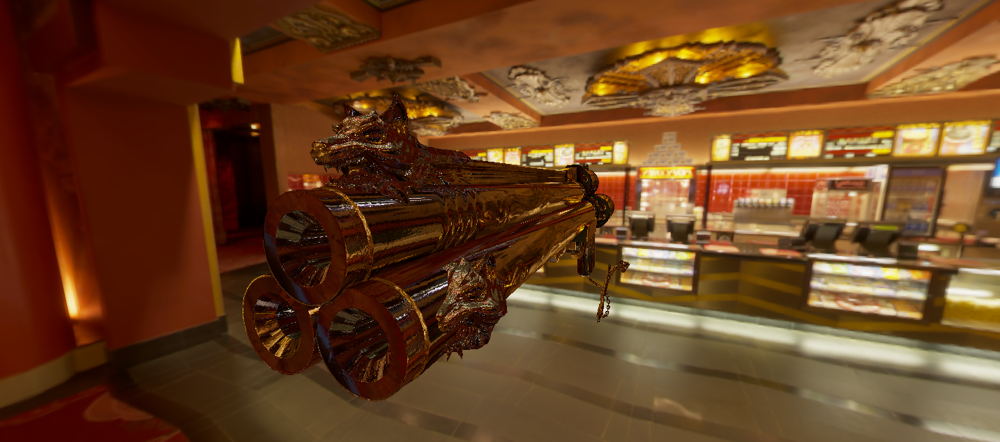

# grr!
##### A bare metal library for OpenGL 4.5+

<br>

[](https://crates.io/crates/grr)
[](https://docs.rs/grr)
[](LICENSE-MIT)
[](LICENSE-Apache2)
[](https://github.com/msiglreith/grr/actions)

```toml
[dependencies]
grr = "0.8"
```

`grr` aims at providing a thin layer above OpenGL 4.5+, exposing a modern API orientated on Vulkan.
The sole purpose of the library is to have a cleaned up API for **fast prototyping**.

## Features
- API is built around **direct state access**
- Following Vulkan terminology and function names
- Only provided latest GL functionality
- Enforce sRGB framebuffer handling

## Getting started
Checkout our [Hello Triangle](https://github.com/msiglreith/grr/blob/master/examples/triangle.rs) example to see the library in action!

## Example
```rust
// Bind graphics pipeline (shaders)
grr.bind_pipeline(&pipeline);
// Configure vertex attributes
grr.bind_vertex_array(&vertex_array);
// Bind vertex buffers for fetching attribute data
grr.bind_vertex_buffers(
    &vertex_array,
    0,
    &[grr::VertexBufferView {
        buffer: &triangle_data,
        offset: 0,
        stride: (std::mem::size_of::<f32>() * 5) as _,
        input_rate: grr::InputRate::Vertex,
    }]
);

// Clear default framebuffer
grr.clear_attachment(grr::Framebuffer::DEFAULT, grr::ClearAttachment::ColorFloat(0, [0.5, 0.5, 0.5, 1.0]));
// Draw triangles
grr.draw(grr::Primitive::Triangles, 0..3, 0..1);

// Present on screen!
window.swap_buffers().unwrap();
```

## Examples

#### Hello Triangle

```
cargo run --example triangle
```

#### Device Information

```
cargo run --example device
```

#### Texture (Logo)

```
cargo run --example texture
```

#### (Maybe-)Physically-based Rendering (IBL)

<h1 align="center">

</h1>

Assets (model and HDRI) need to be extracted into `examples/assets` before running it!

```
cargo run --example pbr --release
```

* Example ported from/based on the PBR tutorial from https://learnopengl.com/ (CC BY-NC 4.0).
* `Cerberus` model by Andrew Maximov (https://artisaverb.info/Cerberus.html)
* `Popcorn Lobby` HDRI from sIBL Archive (http://www.hdrlabs.com/sibl/archive.html)
